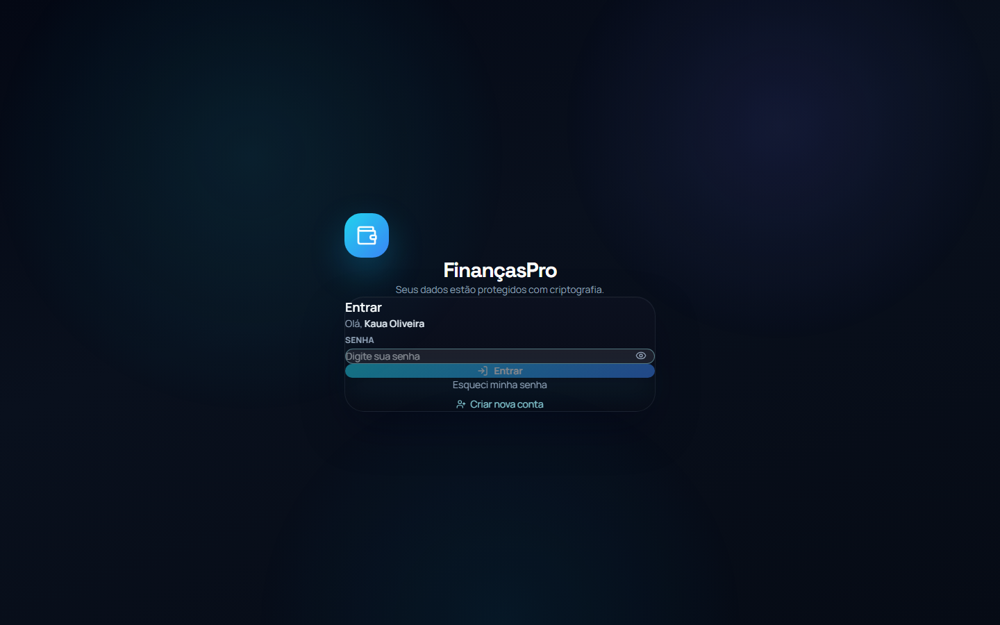
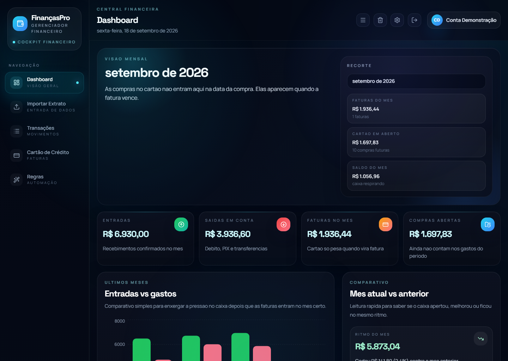
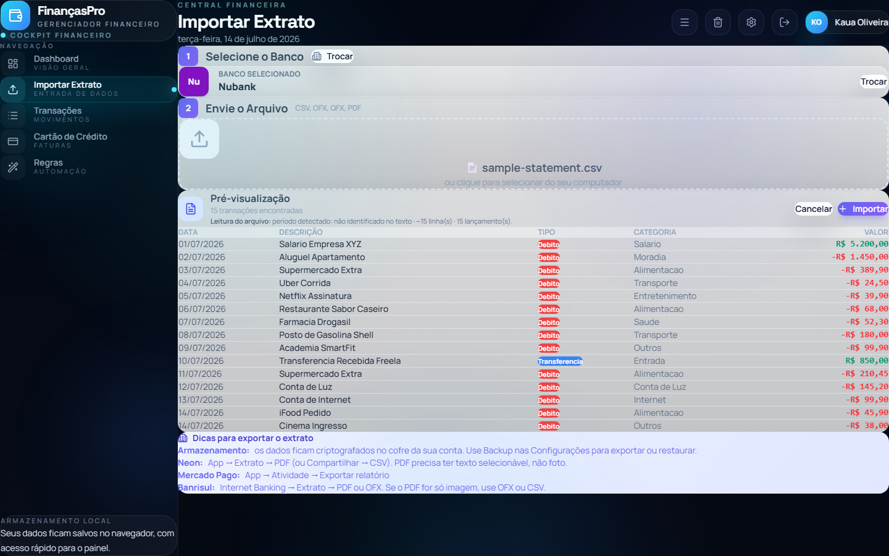
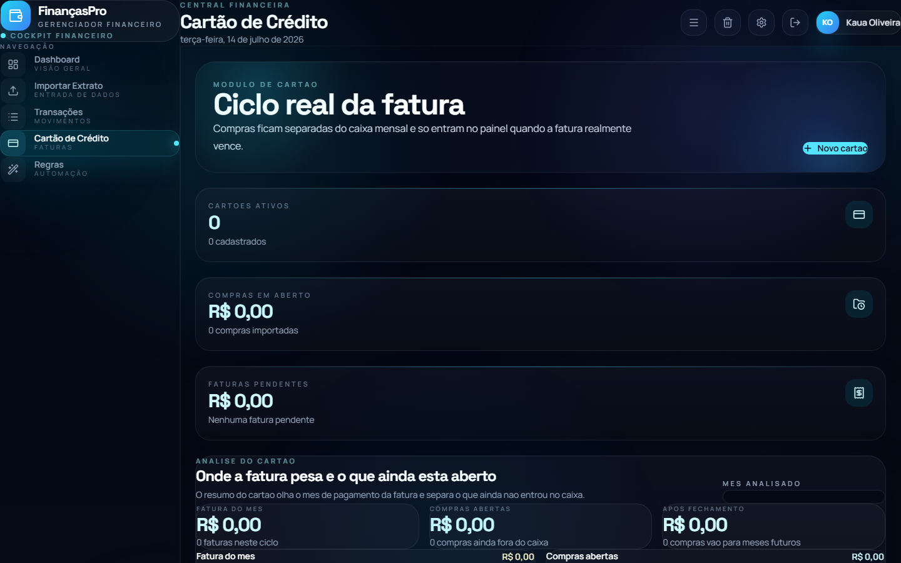

# FinancasPro

[Versão em português](README.md)

Personal finance manager with real end-to-end encryption. Imports bank statements and credit card invoices, consolidates monthly spending by category, and protects everything with AES-256. Your data is never stored in readable form.

The app runs **100% in the browser by default**: no account, no server, no telemetry. There is an **optional cloud mode** (Supabase + Cloudflare) that adds email accounts and sync across devices — and it only reaches the app if whoever deploys it sets two build variables.

The app interface is in Brazilian Portuguese; UI labels below are quoted as they appear on screen.

## Screenshots

| Login | Dashboard |
|---|---|
|  |  |

| Import statement | Credit card |
|---|---|
|  |  |

The screenshots are from July 2026 and don't show invoice import, the recovery kit, or the current UI density yet.

## Why it's different

- **Real privacy**: client-side E2E encryption. No server ever sees your data, no telemetry, no analytics. The key that opens your data only exists in memory while you're logged in — including in cloud mode, where the server stores ciphertext only.
- **Local by default**: without the Supabase variables, the build contains no cloud code at all (a guard at the end of the build checks this).
- **Renewable recovery kit**: 12 words with a short id and a printable sheet. Generating a new kit rotates the data key and really invalidates the previous one.
- **Encrypted backup**: exports a `.financas.enc` file that opens with the kit **or** with the account password as it was at export time. There is no separate backup password anymore.
- **Multi-user by design** (local mode): each account has its own password and isolated vault in the same browser.
- **Zero or near-zero infra cost**: local mode runs on any static host; cloud mode is sized for the Cloudflare and Supabase free plans.

## Stack

| Layer | Technology |
|--------|-----------|
| UI | React 19, TypeScript 6, Tailwind CSS 4 |
| Build | Vite 8 |
| Charts | Recharts |
| Parsing | PapaParse, pdfjs-dist |
| Encryption | Web Crypto API (PBKDF2-SHA256, AES-256-GCM, HKDF) |
| Validation | Zod |
| Cloud (optional) | Supabase (Auth + Postgres), Cloudflare Workers static assets |

## Running locally

```bash
npm install
npm run dev
```

Open `http://localhost:5173`. With no environment variables, the app starts in local mode: sign up with a name and a password, data stored in this browser's `localStorage`.

### Running in cloud mode

Requires a configured Supabase project (see [`docs/deploy/supabase.md`](docs/deploy/supabase.md), sections 1 to 7; the deploy guides are in Portuguese). Create `.env.local` in the repository root (already git-ignored):

```dotenv
VITE_SUPABASE_URL=https://abcd1234.supabase.co
VITE_SUPABASE_ANON_KEY=sb_publishable_...
```

```bash
npm run dev
```

The entry screen now asks for an **email**. If it still asks for a name and a password, the variables did not reach the build.

### Commands

| Command | What it does |
|---|---|
| `npm run dev` | Development server (Vite) |
| `npm run build` | `tsc -b`, production build, and the bundle guard (`scripts/check-bundle.mjs`) |
| `npm run preview` | Serves the built `dist` folder |
| `npm run lint` | ESLint across the repository |
| `npm run test` | Unit tests (Vitest, single run) |
| `npm run test:watch` | Vitest in watch mode |
| `npm run test:e2e` | Playwright in local mode |
| `npm run test:e2e:cloud` | Playwright in cloud mode against a simulated Supabase (`e2e-cloud/mockSupabase.ts`); not part of CI |
| `npm run check:bundle` | Checks the `dist` folder; with `-- --expect-local`, also requires that no cloud code is present |

CI (GitHub Actions) runs lint, unit tests, build, `check:bundle -- --expect-local`, and the local-mode Playwright suite.

### Environment variables

All of them are **public**: they end up in the browser's JavaScript. Full template in [`.env.example`](.env.example).

| Variable | Required | Effect |
|---|---|---|
| `VITE_SUPABASE_URL` | cloud mode only | Supabase Project URL. Must be `https` (except `localhost`). |
| `VITE_SUPABASE_ANON_KEY` | cloud mode only | Publishable key (`sb_publishable_...`) or the legacy anon public key. Accepted alias: `VITE_SUPABASE_PUBLISHABLE_KEY`. |
| `VITE_FORCE_LOCAL` | no | `true` forces local mode even when both variables above are set. |
| `VITE_APP_MODE` | no | Legacy switch kept for compatibility: `local` forces local mode. |

The build **fails** if `VITE_SUPABASE_ANON_KEY` holds a secret key (`sb_secret_...` or a `service_role` JWT), and the bundle guard refuses a `dist` that contains one.

Deploying: [`docs/deploy/supabase.md`](docs/deploy/supabase.md) (database, auth, email) and [`docs/deploy/cloudflare.md`](docs/deploy/cloudflare.md) (site). Both in Portuguese.

## Features

- **Bank statements** (**Importar Extrato** tab): CSV, OFX, and QFX through one generic reader for any bank in the list; text-based PDF only for Neon and Banrisul.
- **Credit card invoices** (**Cartão de Crédito** tab → **Importar fatura**): CSV or text-based PDF through one generic reader for any bank. Before saving, a preview shows which invoice each purchase falls into and the month in which that invoice's total counts as spending.
- **Duplicate detection**: on import, entries already stored are skipped and listed. Identical entries within the same file are kept.
- **Draft kept across tabs**: an import preview survives switching tabs. It lives only in memory and is discarded when you log out or reload the page.
- **Recovery kit** with a short id and a printable sheet, created with the account (at sign-up in local mode, in **Configurar cofre** in cloud mode) and renewable in settings.
- **Encrypted backup** that opens with the kit or with the account password of the time.
- Monthly dashboard: income, account outflows, invoices in their due month, and open card purchases.
- Spend breakdown by category, type, and merchant (with filters).
- Automatic categorization rules (match on part of the description).
- Local authentication with rate limiting (5 attempts, 5-minute lockout).
- Light/dark/system themes.
- Auto-lock after 15 minutes of inactivity.
- Guided onboarding for new users.

### In cloud mode

- **Email and password** accounts, with email confirmation and a 12-character minimum password (the app rejects common passwords and passwords containing your email).
- **Encrypted vault in Supabase**: the whole vault becomes a single compressed, encrypted blob with a version number. The server never sees its contents.
- **Sync across devices**, with a badge in the header (**Sincronizado** / **Sincronizando...** / **Sem sincronizar**). Edits made offline stay on the device and are pushed when the connection returns.
- **Conflicts are never resolved silently**: when two devices edit the same version, the app asks which one to keep.
- **Esqueci a senha** (forgot password) by email, and **Abrir dados com o kit** to get the data back after a reset.
- **Closed beta**: only emails listed in the `beta_allowlist` table can sign up.

## Installing on a phone or a computer

FinancasPro is a PWA: you can install it as an app, with its own icon and name, open it in its own window and use it without internet.

- **Android (Chrome)**: open the site, tap the menu (⋮) and choose **Install app**. Chrome usually offers it on its own as well.
- **Desktop (Chrome or Edge)**: click the install icon in the address bar, or menu → **Install FinancasPro**.
- **iPhone and iPad**: iOS shows no install prompt. Open the site **in Safari**, tap **Share** and choose **Add to Home Screen**. Chrome on iPhone cannot install it.

### What changes offline

| Mode | Offline |
|---|---|
| Local | Everything works. The data never left the device anyway. |
| Cloud | The app opens from the cache and shows the **Sem sincronizar** (not synced) badge. You keep editing and the changes go up when the connection is back. Signing in for the first time on a new device still needs internet. |

Only the app's own files are stored on the device (HTML, JavaScript, CSS, icons and the manifest). **No Supabase response is ever cached** — not the encrypted vault, not the sign-in: those calls always go straight to the network. The rule lives in [`src/pwa/sw-template.js`](src/pwa/sw-template.js) and is locked down by tests in `src/pwa/serviceWorker.test.ts` and `e2e-cloud/pwa.spec.ts`.

The PDF reader (~2 MB) stays out of the install so it does not eat a data plan at once; it is cached the first time you import a PDF while online.

When a new version ships the app does **not** swap itself: a notice reading **"Nova versão do FinançasPro disponível"** appears with an **Atualizar agora** button, so an open form or an import in progress is not lost. Dismissing it only hides it until the next load.

## Account recovery

> **Email gives back access to the account. Only the recovery kit opens the data.**

| What you have | What you get back |
|---|---|
| Email and password (or, in local mode, the password) | Everything |
| The password, but no access to the mailbox | Everything, as long as you remember the password |
| The email, not the password, **with** the kit | The account and the data |
| The email, not the password, **without** the kit | Account access only; data comes back from a backup or not at all |
| None of the above | Nothing: nobody on the project holds your key |

Full table (local and cloud), how to print and store the kit, when to generate a new one, and what changes for backups: [`docs/RECUPERACAO-DE-CONTA.md`](docs/RECUPERACAO-DE-CONTA.md) (in Portuguese).

## How the app counts your money

- **A card purchase doesn't count on the day you buy.** It counts as part of the **invoice total**, in the **month the invoice is due**, even if the invoice isn't marked as paid.
- A purchase made **after** the card's closing day goes into the next invoice.
- **Open purchases** (**Compras abertas**) are purchases whose invoice is due after the month you're viewing. They are shown separately and are not part of that month's total.
- In bank statements, entries typed **Crédito** and **invoice payments** are excluded from spending, so the card isn't counted twice.
- **Duplicates**: for statements, date + description + amount + bank; for invoices, card + date + description + amount. The file name is not part of the match.

Full rules, dated examples, and what to do when an entry lands in the wrong place (in Portuguese): [`docs/IMPORTACAO-E-CALCULOS.md`](docs/IMPORTACAO-E-CALCULOS.md).

## Known import limitations

- **A refund on an invoice increases its total**: the negative amount is read as a positive purchase.
- **Interest, charges, and annual fees are not included** in the invoice total. Purchases whose name contains `total`, `juros`, `limite`, or other filtered words are dropped too.
- **An installment printed with the original purchase date** goes into that old month's invoice. It is dropped instead if the date has no year and falls outside the invoice period.
- **Editing a card's closing or due day** doesn't move purchases already imported to a different invoice.
- **Two different purchases** with the same card, date, description, and amount, coming from different files, become one.
- **In bank statements**, a debit purchase described only as "cartão" (without "débito") is typed as Crédito and excluded from spending.
- **Imported card purchases can't be deleted** one by one. The only way to undo is **Resetar dados**, which erases everything.

Details, how to spot each case, and workarounds (in Portuguese): [`docs/IMPORTACAO-E-CALCULOS.md#5-limitações-conhecidas`](docs/IMPORTACAO-E-CALCULOS.md#5-limitações-conhecidas).

Changelog (in Portuguese): [`CHANGELOG.md`](CHANGELOG.md).

## Security model

### Local account

```
User password
    |
    v
PBKDF2-SHA256 (310k iterations, random salt)
    |
    +--> authKey --> verifier (stored hash, never the password)
    |
    +--> unwrap --> DataKey (AES-256, random per user)
                       |
                       +--> encrypts/decrypts the entire financial vault
                       +--> also wrapped by the 12 words of the kit
                       +--> zeroed in memory on logout/timeout/reload
```

### Cloud account

```
Email ----> authSalt = SHA-256("financaspro/auth-salt/v1|" + email)
              |
Password -----+--> PBKDF2-SHA256 (600k iterations) --> master
                                                        |
                        HKDF "financaspro/auth/v1" -----+--> authSecret --> sent to Supabase
                                                        |                   (which stores a hash of it)
                        HKDF "financaspro/wrap/v1" -----+--> pwWrapKey ----> never leaves the browser
                                                                               |
                                                                               v
                                                        wraps the DataKey, which encrypts the vault
```

**What reaches the server**: the email, the `authSecret` derived from the password (Supabase stores a hash of it), the encrypted vault, the key wraps (also encrypted), and the history of both. **What never leaves the browser**: the password, the `DataKey` that opens the data, and the 12 words of the kit.

**Data at rest**: `localStorage` only holds encrypted blobs and authentication metadata. No transaction description, amount, or card name is readable — in cloud mode the local cache is encrypted too.

**Backup**: `.financas.enc` files in format v2 store the data encrypted with the account data key, plus the key wraps as of export time: they open with that kit **or** with that day's account password. Older files (v1, with their own password) still open.

**The vault is never overwritten when it doesn't open**: if stored data fails to decrypt, the app shows an error screen with **Tentar de novo**, **Sair da conta**, and **Restaurar backup**, and keeps a copy of the unreadable vault before replacing anything.

## What it doesn't do

- It's not open banking: it doesn't connect directly to your bank.
- **In local mode it sends nothing to any server.** In cloud mode it sends only ciphertext the server cannot open.
- It doesn't recover data automatically via email: email only restores account access.
- It doesn't merge edits from two devices automatically: on a conflict, you choose which version stays.
- It doesn't support changing an account's email address.
- It doesn't protect against malware with full access to the running browser.

## Cloud mode caveats (beta)

- The **forgot-password link only works in the same browser** that requested it (the PKCE verifier stays there).
- **Changing the account email breaks login**, because the password salt is derived from the email.
- The **Supabase free plan pauses the project** after days without use. Nothing is deleted: you resume it in the dashboard.
<!-- VERIFICAR: the exact grace period (the Supabase guide says 7 days) comes from the research report, not from a live project; confirm it in the dashboard before promising a number. -->
- **Conflicts between two devices** are resolved by your choice, with no automatic merge.
- The **key history** keeps at least 30 days (after that, the 10 most recent versions) and refuses more than **20 key changes in 24 hours**.
- There is still **no** feedback screen, no privacy/terms page, and no consent screens. **Don't invite other people to the beta at this stage.**

## Architecture

See the full diagram and module map in [`docs/ARCHITECTURE.md`](docs/ARCHITECTURE.md) (in Portuguese).

Main entry points:

| File | Responsibility |
|---------|-----------------|
| `src/App.tsx` | Main shell; loads `CloudRoot` only in cloud builds |
| `src/lib/crypto/crypto.ts` | PBKDF2, AES-GCM, wrap/unwrap, vault envelope |
| `src/lib/crypto/accountKeys.ts` | v2 key derivation for cloud accounts (authSecret + pwWrapKey) |
| `src/lib/crypto/kit.ts` | Kit id, word normalization, and the confirmation draw |
| `src/lib/auth/localAuthProviderV2.ts` | Local accounts on top of the older synchronous provider |
| `src/lib/cloud/cloudAuthProvider.ts` | Cloud accounts: sign-in, kit, password reset, key rotation |
| `src/lib/cloud/syncEngine.ts` | Optimistic sync with a conflict guard |
| `src/lib/vault/` | `VaultStore` (local and cloud) and the queued saver |
| `src/utils/secureStorage.ts` | Encrypted vault in `localStorage`, with typed errors |
| `src/context/FinanceContext.tsx` | Central state and financial aggregations |
| `src/pwa/sw-template.js` | Service worker: precaches the static build, never user data |
| `src/utils/backup.ts` | Backup v2 (kit or password) and readers for the older formats |
| `supabase/migrations/0001_init.sql` | Database tables, policies, and functions |

## Roadmap

### Phase 1 — Secure local foundation (done)

Authentication, E2E encryption, encrypted backup, legacy data migration, auto-lock, recovery kit, unit test suite (Vitest) and E2E tests (Playwright) with GitHub Actions CI.

### Phase 2 — Email accounts (done, closed beta)

Cloud provider on top of Supabase (email login, confirmation, password reset), versioned encrypted vault in the `vaults` table, owner-only-read RLS with writes restricted to functions, vault and key history, cross-device sync with user-chosen conflict resolution, "Abrir dados com o kit", and deployment on Cloudflare Workers.

Access is **closed by an email allowlist** (`beta_allowlist` plus the *Before User Created* hook): an address that is not on the list cannot sign up.

### Phase 3 — Before opening it to other people

- In-app feedback screen (the `feedback` table already exists in the database; the screen does not)
- Privacy and terms page, plus the consent screens
- Pre-go-live checklist and threat model documentation
