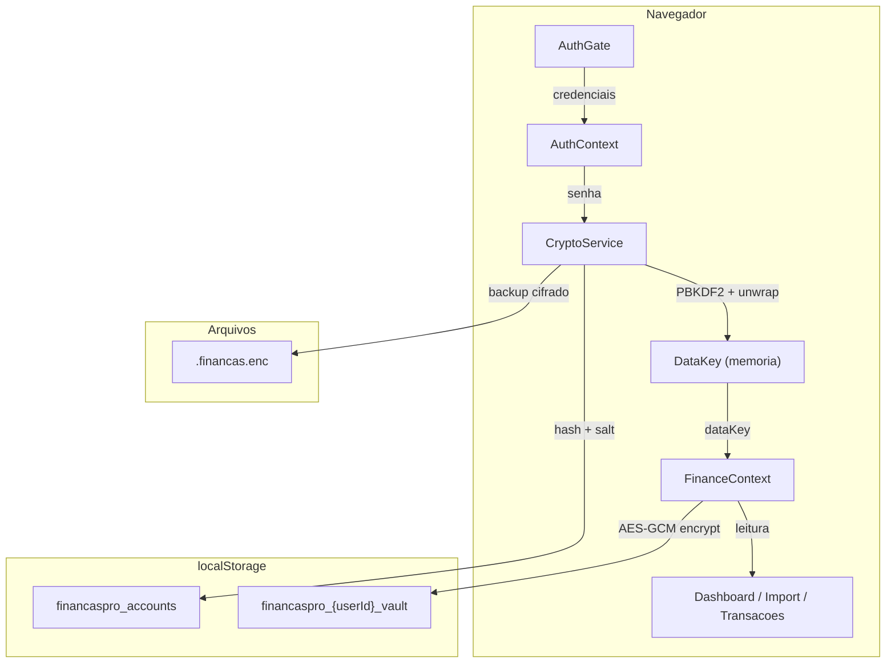
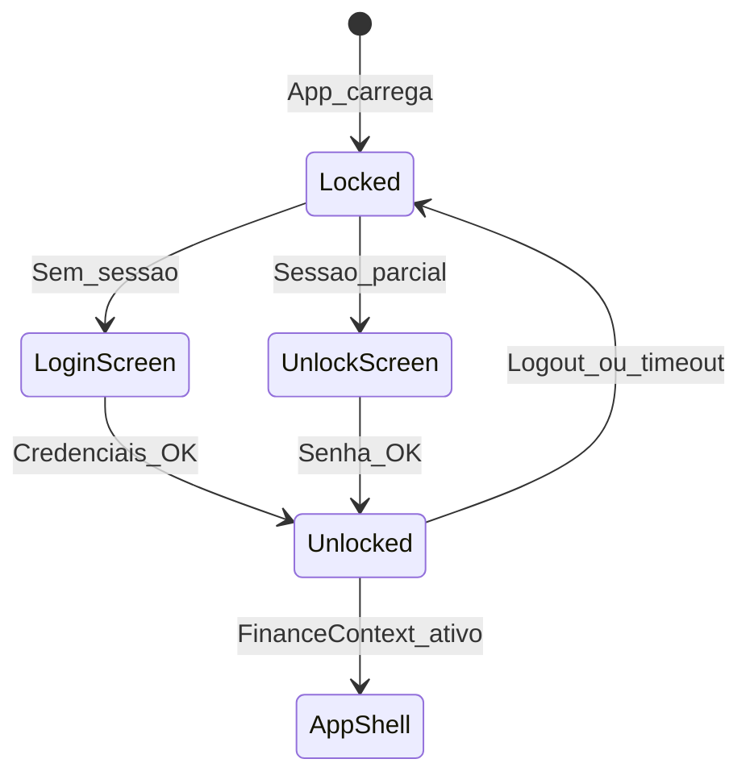
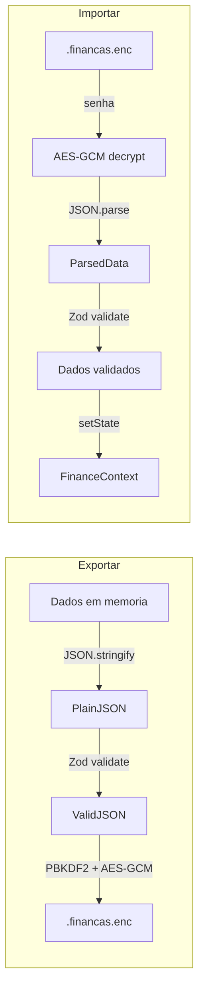

# Arquitetura do FinancasPro

Este documento descreve a arquitetura do cliente, o fluxo de dados e os modulos principais.

## Visao geral

O FinancasPro e um SPA React que roda inteiramente no navegador. Nao existe backend na fase atual. Todos os dados financeiros sao criptografados com AES-256-GCM antes de serem gravados no `localStorage`, e a chave de criptografia so existe em memoria durante uma sessao autenticada.

## Fluxo de autenticacao

1. O usuario abre o app. `AuthGate` verifica se existe sessao ativa.
2. Se nao, mostra `LoginScreen` (ou `RegisterScreen` para novos usuarios).
3. A senha e derivada via PBKDF2-SHA256 (310k iteracoes) para gerar `authKey` e `verifier`.
4. O `verifier` e comparado com o armazenado. Se igual, `authKey` faz unwrap da `dataKey`.
5. A `dataKey` e passada ao `FinanceContext`, que decifra o cofre e carrega os dados em memoria.
6. No logout, timeout de 15 minutos, ou recarga da pagina, a `dataKey` e zerada.

## Mapa de modulos

### Criptografia (`src/lib/crypto/`)

| Arquivo | Responsabilidade |
|---------|-----------------|
| `constants.ts` | Parametros criptograficos (iteracoes PBKDF2, tamanhos de salt/IV/key) |
| `utils.ts` | Helpers: random bytes, Base64, Hex, acesso ao SubtleCrypto |
| `wordlist.ts` | Wordlist em portugues para gerar/normalizar frases de recuperacao |
| `crypto.ts` | Funcoes principais: derivacao de chave, AES-GCM, wrap/unwrap, vault envelope, backup |
| `index.ts` | Re-exports publicos |

### Autenticacao (`src/lib/auth/`)

| Arquivo | Responsabilidade |
|---------|-----------------|
| `types.ts` | Contratos: `AuthProvider`, `AuthSession`, `UserAccount` |
| `localAuthProvider.ts` | Multi-usuario local com rate limit (5 tentativas, 5 min lockout) |
| `index.ts` | Re-exports |

### Contextos React (`src/context/`)

| Arquivo | Responsabilidade |
|---------|-----------------|
| `AuthContext.tsx` | Estado global de autenticacao, auto-lock, beforeunload |
| `FinanceContext.tsx` | Estado financeiro (transacoes, cartoes, faturas, regras), persistencia cifrada |
| `FinanceContext.shared.ts` | Interface `FinanceContextType` compartilhada |
| `useFinance.ts` | Hook de acesso ao contexto financeiro |

### Storage e backup (`src/utils/`)

| Arquivo | Responsabilidade |
|---------|-----------------|
| `secureStorage.ts` | Leitura/escrita cifrada no localStorage, namespaced por userId |
| `backup.ts` | Export/import `.financas.enc`, validacao de schema com Zod |
| `parser.ts` | Parsing de CSV, OFX, PDF de extratos bancarios |
| `categorize.ts` | Categorizacao automatica por pattern matching |
| `credit.ts` | Logica de faturas, vencimento, status |

### Componentes de autenticacao (`src/components/auth/`)

| Arquivo | Responsabilidade |
|---------|-----------------|
| `AuthGate.tsx` | Renderiza login/registro/recovery ou o app, conforme estado de auth |
| `LoginScreen.tsx` | Tela de login com selecao de conta e rate limit |
| `RegisterScreen.tsx` | Registro com geracao de frase de recuperacao e migracao legada |
| `RecoveryScreen.tsx` | Recuperacao de conta via frase de 12 palavras |

### Componentes de interface (`src/components/`)

| Arquivo | Responsabilidade |
|---------|-----------------|
| `Dashboard.tsx` | Visao analitica mensal com graficos e filtros |
| `ImportStatement.tsx` | Fluxo de importacao de extratos e faturas |
| `TransactionList.tsx` | Lista de transacoes com edicao |
| `CreditCardView.tsx` | Gestao de cartoes e faturas |
| `CategoryRules.tsx` | Regras de categorizacao automatica |
| `SettingsModal.tsx` | Configuracoes: tema, senha, backup cifrado |
| `Sidebar.tsx` | Navegacao lateral |

## Fluxo de dados do backup

## Decisoes de design

- **Sem framework de estado externo**: `useContext` + `useState` e suficiente para a complexidade atual. Zustand ou Jotai entram se necessario na fase full stack.
- **Lazy loading de rotas**: cada aba do app e carregada sob demanda via `React.lazy`.
- **Debounce na persistencia**: o `FinanceContext` usa `setTimeout(300ms)` para evitar gravar no localStorage a cada keystroke.
- **CSP restritiva**: `script-src 'self'` impede execucao de scripts injetados. Fontes externas sao limitadas a Google Fonts.
- **Sem dependencias de runtime para criptografia**: tudo via Web Crypto API nativa do navegador.
