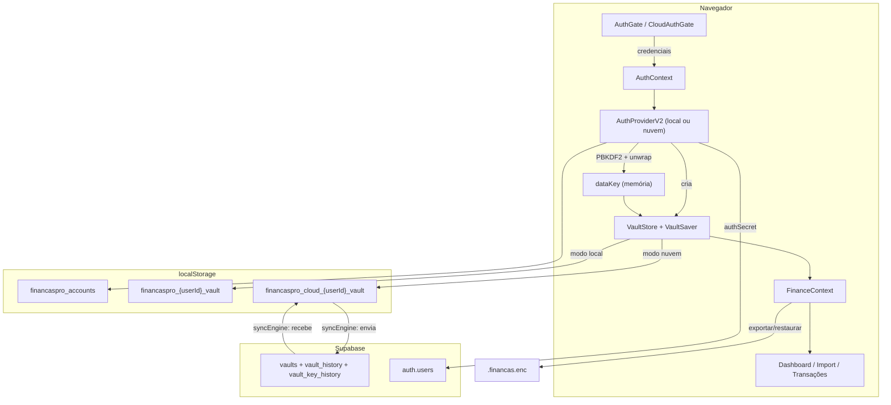
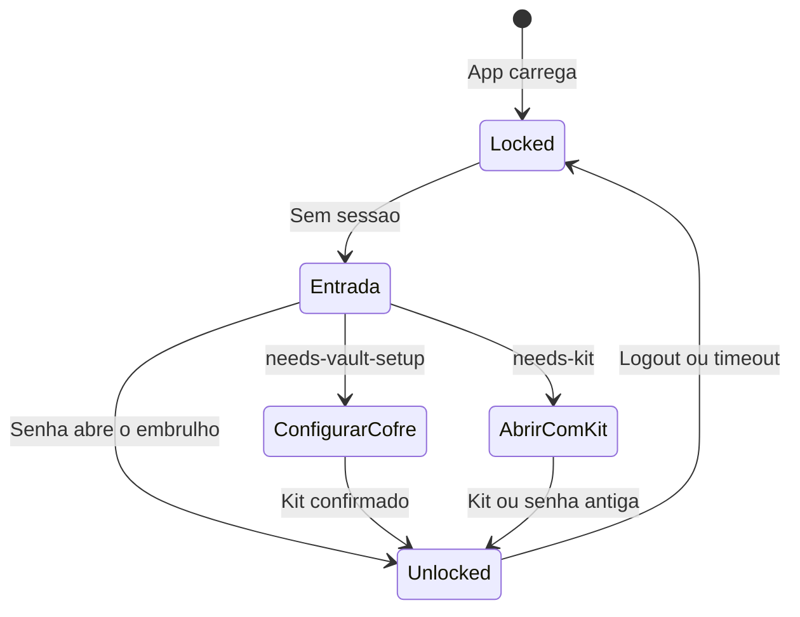
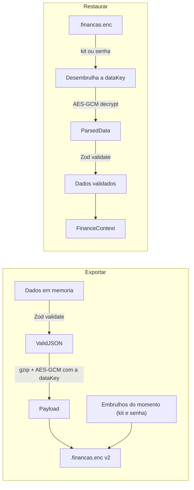

# Arquitetura do FinançasPro

Este documento descreve o cliente, o fluxo de dados e os módulos principais. Ele é para quem vai manter o código.

## Visão geral

O FinançasPro é um SPA React que roda inteiramente no navegador. Ele tem **dois modos**, decididos no build:

| Modo | Quando | O que existe |
|---|---|---|
| **Local** (padrão) | Sem `VITE_SUPABASE_URL` e `VITE_SUPABASE_ANON_KEY` (ou com `VITE_FORCE_LOCAL=true`) | Contas neste navegador, cofre cifrado no `localStorage`, nenhuma rede |
| **Nuvem** | Com as duas variáveis | Conta por e-mail no Supabase, cofre cifrado na nuvem, cache cifrado local, sincronização |

`vite.config.ts` lê as variáveis com `readCloudConfig` e define `__FINANCASPRO_CLOUD__`. Quando ele é `false`, todo ramo de nuvem vira código morto e o bundler descarta os módulos `src/lib/cloud/*` e o `@supabase/supabase-js`. `scripts/check-bundle.mjs --expect-local` falha se algum vestígio sobrar (roda na CI).

Em qualquer modo, os dados financeiros são cifrados com AES-256-GCM antes de serem gravados, e a chave que os abre (`dataKey`) só existe em memória durante uma sessão autenticada.

## Esquema de chaves

Uma frase por item:

- **Senha de uma conta local**: PBKDF2-SHA256 com 310 mil iterações e salt aleatório gera a `authKey`; dela saem o `verifier` gravado (nunca a senha) e o desembrulho da `dataKey`.
- **Senha de uma conta de nuvem**: PBKDF2-SHA256 com 600 mil iterações sobre um salt derivado do e-mail (`SHA-256("financaspro/auth-salt/v1|" + e-mail)`) gera um `master`, e dele o HKDF tira duas coisas — `authSecret` e `pwWrapKey`.
- **`authSecret`**: é o que o app manda ao Supabase como "senha" (43 caracteres base64url); o servidor guarda apenas um hash dele e nunca vê a senha real.
- **`pwWrapKey`**: chave AES-GCM que **nunca sai do navegador** e serve só para embrulhar e desembrulhar a `dataKey`.
- **`dataKey`**: chave AES-256 aleatória por conta que cifra o cofre inteiro; existe só em memória e é descartada no logout, no auto-lock de 15 minutos e ao recarregar a página.
- **Kit de recuperação**: 12 palavras que, por PBKDF2, geram uma segunda chave de embrulho da mesma `dataKey` — é a única forma de abrir os dados sem a senha.
- **O que vai ao servidor**: e-mail, `authSecret`, cofre cifrado, embrulhos de chave (cifrados) e o histórico dos dois. **O que nunca sai do navegador**: senha, `dataKey` e as 12 palavras.
- **Backup v2**: os dados cifrados com a `dataKey` mais os dois embrulhos do momento da exportação, então o arquivo abre com o kit ou com a senha daquele dia.

Trocar o e-mail de uma conta de nuvem **quebra o login**: o salt deriva do e-mail. O app não oferece essa troca.

## Fluxo de autenticação

### Modo local

1. `AuthGate` verifica se há sessão ativa; se não, mostra `LoginScreen` ou `RegisterScreen`.
2. A senha deriva `authKey` e `verifier`; o `verifier` é comparado com o gravado.
3. Com a senha certa, a `authKey` desembrulha a `dataKey`.
4. No cadastro, o app gera o kit, mostra a folha imprimível e pede **3 palavras sorteadas** antes de concluir.
5. `FinanceContext` recebe um `VaultStore` criado pelo provedor e decifra o cofre.

### Modo nuvem

`CloudRoot` carrega o `@supabase/supabase-js` sob demanda, cria o cliente em modo **PKCE** e monta o `CloudAuthGate`. `signIn` devolve um de três estados:

| Estado | Significado | Tela |
|---|---|---|
| `unlocked` | A senha abriu o embrulho da `dataKey` | App |
| `needs-vault-setup` | A conta existe, o cofre ainda não | `VaultSetupScreen` ("Configurar cofre") |
| `needs-kit` | O login funciona, mas a senha não abre os dados | `OpenWithKitScreen` ("Abrir dados com o kit") |

`needs-kit` é o caso normal depois de "Esqueci a senha": a redefinição por e-mail troca só o segredo de login. Em `OpenWithKitScreen`, o usuário digita o kit, tenta a senha antiga, restaura um backup ou começa do zero. Ao recuperar, o app procura uma chave que abra — primeiro os embrulhos atuais, depois o histórico de chaves — e, se ela só abrir uma cópia antiga do cofre, mostra a data e pede confirmação antes de restaurá-la.

## Mapa de módulos

### Criptografia (`src/lib/crypto/`)

| Arquivo | Responsabilidade |
|---------|-----------------|
| `constants.ts` | Parâmetros (310k iterações local, 600k nuvem, tamanhos, rótulos HKDF) |
| `utils.ts` | Helpers: bytes aleatórios, Base64, Hex, acesso ao SubtleCrypto |
| `wordlist.ts` | Wordlist em português para gerar/normalizar a frase de 12 palavras |
| `crypto.ts` | Derivação de chave, AES-GCM, wrap/unwrap, envelope do cofre, giro de chave (`rotateVaultKey`), backup v1 |
| `accountKeys.ts` | Derivação v2 das contas de nuvem: `authSecret` + `pwWrapKey`, `wrapKeyWith`/`unwrapKeyWith` |
| `kit.ts` | Id curto do kit, normalização de palavras (sem acento, minúsculas) e sorteio das 3 posições de confirmação |
| `compression.ts` | gzip via `CompressionStream`, usado nos payloads cifrados |
| `index.ts` | Re-exports públicos |

### Autenticação (`src/lib/auth/`)

| Arquivo | Responsabilidade |
|---------|-----------------|
| `types.ts` | Contratos: `AuthProviderV2`, `AuthSession`, `SignInResult`, `KitRenewal`, `KeyInfo`, `SyncStatus` |
| `localAuthProvider.ts` | Multiusuário local síncrono, rate limit (5 tentativas, 5 min) e `prepareKitRenewal` |
| `localAuthProviderV2.ts` | Adapta o provedor local ao contrato assíncrono e cria o `VaultStore` local |
| `createAuthProvider.ts` | Provedor usado nos builds locais |

### Cofre (`src/lib/vault/`)

| Arquivo | Responsabilidade |
|---------|-----------------|
| `types.ts` | Interface `VaultStore` (load, save, preserveUnreadable, e os ganchos de nuvem) |
| `localVaultStore.ts` | `VaultStore` sobre `secureStorage`, com recusa de escrita quando a chave ficou velha |
| `vaultSaver.ts` | Fila de gravação: debounce, uma escrita por vez, dados que falharam continuam pendentes |
| `migrateLegacy.ts` | Migra o texto puro da primeira versão do app; só apaga depois de reler o cifrado |

### Nuvem (`src/lib/cloud/`)

| Arquivo | Responsabilidade |
|---------|-----------------|
| `env.ts` | Lê as variáveis públicas, recusa chaves secretas e monta o `connect-src` da CSP (também usado pelo `vite.config.ts`) |
| `config.ts` | Re-exports e a constante `cloudEnabled` (`__FINANCASPRO_CLOUD__`) |
| `loadCloudProvider.ts` | Importa o supabase-js sob demanda, cria o cliente PKCE, lê erros de link de e-mail e limpa a URL |
| `backend.ts` | Contrato `CloudBackend` (cofre, histórico, chaves, sessão), independente do Supabase |
| `supabaseBackend.ts` | Implementação do contrato com supabase-js e as RPCs do banco |
| `cloudAuthProvider.ts` | Cadastro, entrada, kit, redefinição de senha, troca de senha, giro de chaves e ciclo de vida da sessão |
| `cloudVaultStore.ts` | `VaultStore` sobre o cache cifrado do aparelho; guarda a versão-base de cada gravação |
| `vaultCache.ts` | Cache local cifrado por usuário, índice de contas e id do aparelho |
| `vaultCrypto.ts` | Cifra/decifra o cofre (gzip + AES-GCM), cria e abre embrulhos de kit e de senha |
| `syncEngine.ts` | Sincronização otimista, estados, conflitos e gatilhos do navegador |
| `passwordPolicy.ts` | Regra de senha do modo nuvem (mínimo 12, lista de senhas comuns, não conter o e-mail) |
| `errors.ts` | `CloudError` com mensagem pronta em português |

### Contextos React (`src/context/`)

| Arquivo | Responsabilidade |
|---------|-----------------|
| `AuthContext.tsx` | Estado de autenticação, auto-lock de 15 min, `beforeunload`, repasse do provedor |
| `FinanceContext.tsx` | Estado financeiro, agregações, persistência pelo `VaultSaver`, tela de erro de leitura |
| `FinanceContext.shared.ts` | Interface `FinanceContextType` |
| `ImportDraftContext.tsx` | Pré-visualização de importação em memória ao trocar de aba; nunca grava em storage |
| `useFinance.ts`, `useAuth.ts`, `useImportDraft.ts` | Hooks de acesso |

### Storage, backup e cálculos (`src/utils/`)

| Arquivo | Responsabilidade |
|---------|-----------------|
| `secureStorage.ts` | Cofre cifrado por `userId`; `VaultLoadError`/`VaultSaveError` tipados; cópia do cofre ilegível |
| `backup.ts` | Backup v2 (embrulhos de kit e senha), leitura de v1 e de JSON legado, validação Zod |
| `parser.ts` | Leitura de extratos (CSV, OFX, QFX; PDF de Neon e Banrisul) e de faturas (CSV e PDF genéricos) |
| `categorize.ts` | Categoria e tipo do lançamento; detecção de pagamento de fatura |
| `credit.ts` | Ciclo da fatura, fechamento, vencimento, mês de pagamento e status |
| `importMerge.ts` | Remoção de repetidos por multiconjunto (extrato e fatura) |
| `cardImport.ts` | Agrupamento da pré-visualização por fatura e mensagens da importação |

### Componentes

| Arquivo | Responsabilidade |
|---------|-----------------|
| `components/auth/AuthGate.tsx` | Login, registro ou recuperação no modo local |
| `components/auth/RecoveryKit.tsx` | Folha do kit na tela e versão para impressão; confirmação das 3 palavras |
| `components/auth/RecoveryScreen.tsx` | Recuperação local pela frase de 12 palavras |
| `components/cloud/CloudRoot.tsx` | Entrada dos builds de nuvem: carrega o provedor e trata a falha de carregamento |
| `components/cloud/CloudAuthGate.tsx` | Decide entre login, cadastro, confirmação, nova senha, configurar cofre e abrir com o kit |
| `components/cloud/OpenWithKitScreen.tsx` | Kit, senha antiga, restaurar backup ou começar do zero |
| `components/cloud/VaultSetupScreen.tsx` | Primeiro cofre: kit, confirmação e início vazio ou por backup |
| `components/RecoveryKitSettings.tsx` | "Gerar kit novo": senha, folha, 3 palavras e só então o giro da chave |
| `components/BackupSettings.tsx` / `BackupImport.tsx` | Exportar backup v2; restaurar v2 (kit ou senha), v1 ou JSON |
| `components/VaultLoadErrorScreen.tsx` | Cofre que não abre: tentar de novo, sair, restaurar backup |
| `components/SyncBadge.tsx` / `SyncConflictDialog.tsx` | Estado da sincronização e escolha de versão no conflito |
| `components/Dashboard.tsx`, `ImportStatement.tsx`, `CardStatementImport.tsx`, `TransactionList.tsx`, `CreditCardView.tsx`, `CategoryRules.tsx`, `SettingsModal.tsx`, `Sidebar.tsx` | Telas do app |

## Sincronização (modo nuvem)

O cofre inteiro é um único blob: `gzip(JSON)` cifrado com a `dataKey`, guardado na coluna `ciphertext` com um `version` que o servidor incrementa.

- **Gravação local** vai para o cache cifrado do aparelho e agenda um envio com 3 s de debounce (`PUSH_DEBOUNCE_MS`).
- **Leitura** acontece na entrada, ao voltar o foco (no máximo a cada 60 s, `PULL_STALE_MS`), quando a internet volta e antes de esconder a página.
- **Envio** manda a versão esperada. Se o servidor recusar, o app entra em `conflict` e **pergunta** ao usuário: `use-remote` ou `keep-local`. Não existe fusão automática.
- **Dados remotos que a chave da sessão não abre nunca substituem o que está no aparelho**: o estado vira `blocked` com uma explicação.
- **Chaves mudadas em outro aparelho** são adotadas apenas quando o embrulho remoto abre com a senha desta sessão e decifra o cofre remoto.

Estados possíveis: `synced`, `syncing`, `pending`, `offline`, `conflict`, `blocked`, `error`. O `SyncBadge` mostra "Sincronizado", "Sincronizando..." ou "Sem sincronizar" e vira botão quando há ação a tomar.

## Banco de dados (`supabase/migrations/0001_init.sql`)

| Tabela | Para quê | Acesso |
|---|---|---|
| `vaults` | Uma linha por usuário: `kdf`, `pw_wrap`, `kit_wrap`, `ciphertext`, `version`, `keys_version` | `select` e `insert` do próprio dono; sem `update`/`delete` diretos |
| `vault_history` | Até 7 cópias do cofre, no máximo uma a cada ~20 h | Só leitura do dono |
| `vault_key_history` | Toda troca de `kdf`, `pw_wrap` ou `kit_wrap`; nada com menos de 30 dias é apagado e, passado isso, ficam as 10 mais recentes; teto de 20 trocas em 24 h | Só leitura do dono |
| `feedback` | Opinião dos testadores | Só inserção (a tela ainda não existe no app) |
| `beta_allowlist` | Beta fechado, via hook *Before User Created* | Só o `supabase_auth_admin` lê |

Alterações do cofre passam pelas funções `save_vault`, `set_password_wrap` e `rotate_vault_keys`, que conferem a versão esperada e devolvem `null` em conflito. O ataque considerado no desenho é o de alguém que controla o e-mail: ele consegue sessão, mas o histórico de cofre e de chaves permite ao dono voltar com o kit.

O script `supabase/tests/0001_init_check.sql` roda dentro de uma transação com `rollback` e confere o esquema num projeto de teste.

## Fluxo do backup

Formatos aceitos na restauração: **v2** (kit ou senha da conta da época), **v1** (senha própria do backup, formato antigo) e JSON puro da primeira versão do app. Limite de 10 MB por arquivo.

Regras de cálculo (fatura no mês de vencimento, compras abertas, repetidos) estão descritas para o usuário em [`IMPORTACAO-E-CALCULOS.md`](IMPORTACAO-E-CALCULOS.md). Recuperação de conta, para o usuário: [`RECUPERACAO-DE-CONTA.md`](RECUPERACAO-DE-CONTA.md).

## Decisões de design

- **Sem framework de estado externo**: `useContext` + `useState` dá conta da complexidade atual.
- **Nuvem opcional em tempo de build**: `__FINANCASPRO_CLOUD__` evita que quem usa o modo local carregue (ou confie em) código de nuvem.
- **Um provedor, duas implementações**: telas e contextos conversam com `AuthProviderV2` e `VaultStore`; local e nuvem são intercambiáveis.
- **Nunca sobrescrever o que não abre**: `loadVaultData` lança erro tipado em vez de devolver vazio, e qualquer substituição guarda antes uma cópia do cofre ilegível.
- **Conflito é decisão do usuário**: fundir lançamentos automaticamente inventaria ou apagaria dinheiro.
- **Lazy loading**: cada aba e o módulo de nuvem entram sob demanda via `React.lazy`/`import()`.
- **Debounce na persistência**: 300 ms no `VaultSaver` local, 3 s antes de enviar à nuvem.
- **CSP restritiva**: `script-src 'self'`; o `connect-src` recebe a origem do Supabase no build; `public/_headers` repete as regras no servidor.
- **Sem dependências de runtime para criptografia**: tudo via Web Crypto API nativa.
